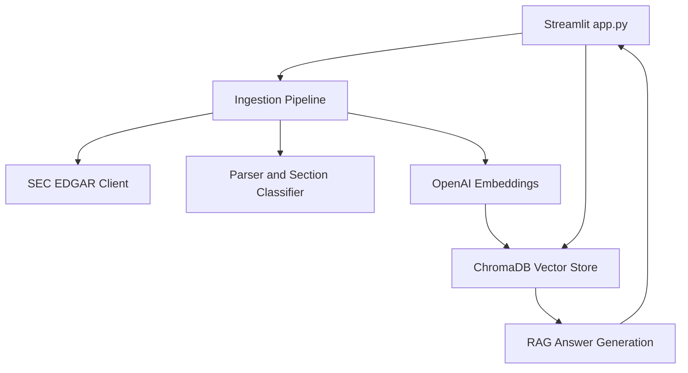

\# SEC 10-K Intelligence Assistant


\## Project Overview

This project is a RAG-based financial document intelligence assistant built using public SEC EDGAR 10-K filings. The app allows users to select a company, download its latest 10-K filing, index the document using embeddings, and ask natural language questions about business risks, cybersecurity, legal risks, competition, and company operations.


\## Problem Statement

SEC 10-K filings are long and difficult to review manually. Analysts, business users, and compliance teams often need quick answers from these filings. This project demonstrates how GenAI and RAG can help retrieve relevant filing sections and generate source-grounded answers.


\## Tools Used

\- Python

\- Streamlit

\- ChromaDB

\- OpenAI Embeddings

\- OpenAI Chat Model

\- SEC EDGAR API

\- BeautifulSoup

\- dotenv


\## Key Features

\- Downloads latest public SEC 10-K filings

\- Parses and cleans filing text

\- Splits long filings into chunks

\- Creates vector embeddings

\- Stores document chunks in ChromaDB

\- Retrieves relevant chunks using semantic search

\- Generates source-grounded answers

\- Displays retrieved source chunks for explainability


\## Sample Questions Tested

\- What are the company's main risk factors?

\- What are the company's top 5 risk factors?

\- Summarize the business model in simple terms.

\- What does the company say about cybersecurity?

\- What are the major legal and regulatory risks?

\- What does the company say about competition?


\## Current Status

MVP completed and tested locally using Streamlit.


\## Next Improvements

\- Add section filters for Business, Risk Factors, MD\&A, Cybersecurity, and Legal Proceedings

\- Add company comparison mode

\- Add PostgreSQL metadata storage

\- Add Docker deployment

\- Add AWS S3 storage for raw filings

\- Add GitHub Actions for CI/CD


\## Security Note

The `.env` file is not included in GitHub because it contains private API credentials.

## Version Updates

### Version 1: RAG MVP
- Built a Streamlit-based SEC 10-K Intelligence Assistant
- Added public SEC EDGAR 10-K filing ingestion
- Added document parsing, chunking, OpenAI embeddings, ChromaDB vector storage, semantic retrieval, and source-grounded answer generation

### Version 2: Section Filters
- Added section filters for Business, Risk Factors, Cybersecurity, Competition, Legal / Regulatory, and Financial Risks
- Added lightweight section tagging for SEC 10-K chunks
- Improved targeted retrieval using ticker and section metadata
- Updated retrieved source display to show section names

### Version 3: Docker and Evaluation Preparation
- Added Dockerfile for containerized Streamlit app execution
- Added .dockerignore to prevent secrets, local vector database files, cache files, and screenshots from being copied into Docker images
- Added evaluation_questions.md to manually test retrieval quality across key SEC 10-K sections


## Version 3 Architecture



### Source Modules

- `src/config.py` - Environment configuration
- `src/sec_client.py` - SEC EDGAR requests and filing downloads
- `src/parser.py` - HTML cleaning, chunking, and section classification
- `src/embeddings.py` - OpenAI embedding generation
- `src/vector_store.py` - ChromaDB storage and semantic retrieval
- `src/rag.py` - Source-grounded answer generation
- `src/ingestion.py` - Filing ingestion orchestration
- `app.py` - Streamlit user interface

## Docker Run

Build the Docker image:

```powershell
docker build -t sec-10k-rag-assistant:v3 .