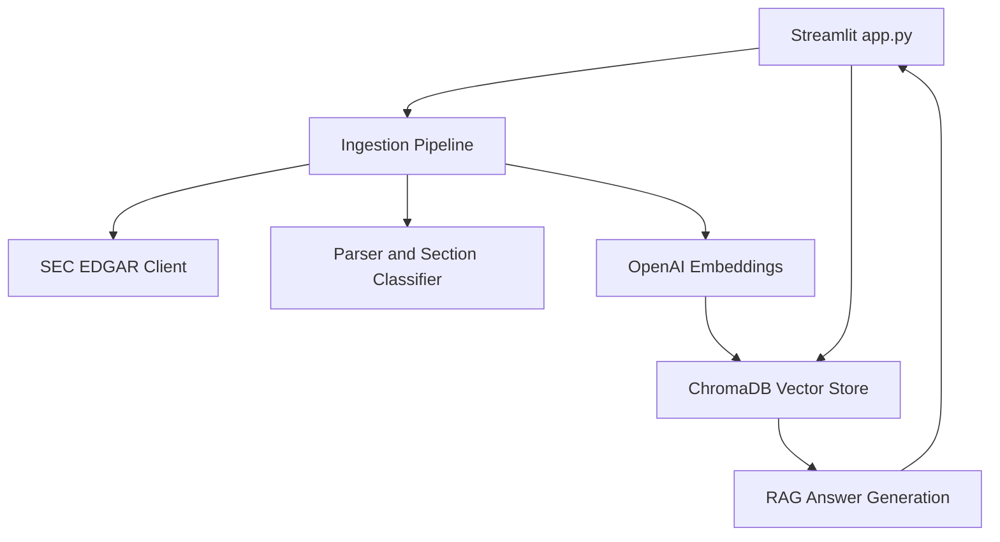

# SEC 10-K Intelligence Assistant


## Project Overview

This project is a RAG-based financial document intelligence assistant built using public SEC EDGAR 10-K filings. The app allows users to select a company, download its latest 10-K filing, index the document using embeddings, and ask natural language questions about business risks, cybersecurity, legal risks, competition, and company operations.


## Problem Statement

SEC 10-K filings are long and difficult to review manually. Analysts, business users, and compliance teams often need quick answers from these filings. This project demonstrates how GenAI and RAG can help retrieve relevant filing sections and generate source-grounded answers.


## Tools Used

- Python
- Streamlit
- ChromaDB
- OpenAI Embeddings
- OpenAI Chat Model
- SEC EDGAR API
- BeautifulSoup
- Docker
- python-dotenv


## Key Features

- Downloads latest public SEC 10-K filings from SEC EDGAR
- Parses and cleans SEC filing HTML
- Splits long filings into searchable chunks
- Creates OpenAI embeddings for filing chunks
- Stores document chunks and metadata in ChromaDB
- Retrieves relevant chunks using semantic search
- Applies section filters for Business, Risk Factors, Cybersecurity, Competition, Legal / Regulatory, and Financial Risks
- Generates source-grounded answers with retrieved source chunks
- Adds Company Comparison Mode for comparing two public companies
- Displays retrieved sources separately for single-company and comparison workflows
- Runs locally with Streamlit or through Docker


## Sample Questions Tested

- What are the company's main risk factors?
- What are the company's top 5 risk factors?
- Summarize the business model in simple terms.
- What does the company say about cybersecurity?
- What are the major legal and regulatory risks?
- What does the company say about competition?


## Comparison Questions Tested

- Compare the main risk factors between two companies.
- How do these companies describe cybersecurity risks differently?
- Compare the competitive pressures discussed by both companies.
- What legal or regulatory risks are similar across both filings?
- Which company appears more exposed to financial risk based on the retrieved sections?


## Current Status

Version 4 completed and pushed to GitHub. The app supports single-company SEC 10-K question answering, section-filtered retrieval, company comparison mode, modular source code, Docker-based execution, and project screenshots.

## Next Improvements

- Add formal SEC Item parsing for Item 1, Item 1A, Item 7, and Item 7A
- Add PostgreSQL metadata storage for ticker, CIK, filing date, accession number, and ingestion status
- Add AWS S3 storage for raw filing documents
- Add automated retrieval evaluation metrics
- Add GitHub Actions for CI/CD checks
- Add cloud deployment using Streamlit Community Cloud, Render, Azure Container Apps, or AWS ECS


## Security Note

The `.env` file is not included in GitHub because it contains private API credentials.

## Version Updates

**Version 1:** RAG MVP
- Built a Streamlit-based SEC 10-K Intelligence Assistant
- Added public SEC EDGAR 10-K filing ingestion
- Added document parsing, chunking, OpenAI embeddings, ChromaDB vector storage, semantic retrieval, and source-grounded answer generation

**Version 2:** Section Filters
- Added section filters for Business, Risk Factors, Cybersecurity, Competition, Legal / Regulatory, and Financial Risks
- Added lightweight section tagging for SEC 10-K chunks
- Improved targeted retrieval using ticker and section metadata
- Updated retrieved source display to show section names

**Version 3:** Docker and Evaluation Preparation
- Added Dockerfile for containerized Streamlit app execution
- Added .dockerignore to prevent secrets, local vector database files, cache files, and screenshots from being copied into Docker images
- Added evaluation_questions.md to manually test retrieval quality across key SEC 10-K sections


## Version 3 Architecture



### Source Modules

- `src/config.py` - Environment configuration
- `src/sec_client.py` - SEC EDGAR requests and filing downloads
- `src/parser.py` - HTML cleaning, chunking, and section classification
- `src/embeddings.py` - OpenAI embedding generation
- `src/vector_store.py` - ChromaDB storage and semantic retrieval
- `src/rag.py` - Source-grounded answer generation
- `src/ingestion.py` - Filing ingestion orchestration
- `app.py` - Streamlit user interface

## Docker Run

Build the Docker image:

```powershell
docker build -t sec-10k-rag-assistant:v4 .
```

Run the app in Docker:

```powershell
docker run --rm -p 8501:8501 --env-file .env sec-10k-rag-assistant:v4
```

Open the app:

```text
http://localhost:8501
```

**Version 4:** Company Comparison Mode

Version 4 adds Company Comparison Mode, allowing users to compare two public companies across selected SEC 10-K sections with source-grounded answers and retrieved source chunks for each company.


**Version 5:** Automated Retrieval Evaluation

Version 5 adds an automated evaluation pipeline for measuring whether semantic retrieval returns chunks from the expected SEC 10-K sections.

### Evaluation Metrics

- Evaluation questions: 12
- Hit Rate@5: 91.7%
- Hit Rate@10: 100%
- Mean Reciprocal Rank: 0.600

### Run Evaluation

The selected company must already be indexed in ChromaDB.

```powershell
py run_evaluation.py --ticker AAPL --top-k 10 

evaluation_results/ 

**Version 6:** Formal SEC Item Parsing

Version 6 replaces lightweight keyword-based section tagging with formal SEC 10-K item parsing.

The app now extracts and tags official filing sections including:

- Item 1 - Business
- Item 1A - Risk Factors
- Item 1C - Cybersecurity
- Item 3 - Legal Proceedings
- Item 7 - MD&A
- Item 7A - Market Risk
- Item 8 - Financial Statements

This improves section-filtered retrieval accuracy by storing official SEC item metadata in ChromaDB instead of relying only on keyword detection.

### V6 Validation

- Confirmed parser extraction for AAPL official 10-K sections
- Confirmed ChromaDB metadata storage with `sec_item`
- Confirmed retrieval for `Item 1A - Risk Factors`
- Confirmed retrieval for `Item 1C - Cybersecurity`