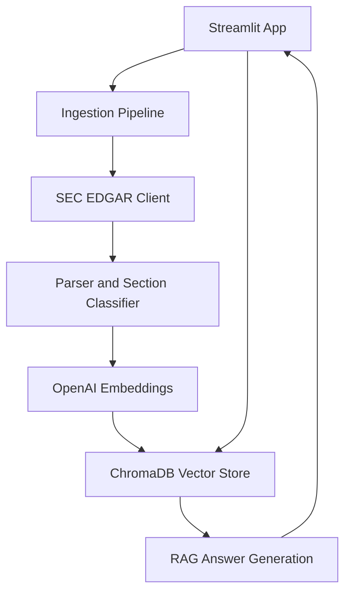

# SEC Filing Intelligence Platform


## Project Overview

This project is a data-engineered RAG-based financial document intelligence platform built using public SEC EDGAR 10-K filings.

## Demo


## Problem Statement

SEC 10-K filings are long and difficult to review manually. Analysts, business users, and compliance teams often need quick answers from these filings. This project demonstrates how GenAI and RAG can help retrieve relevant filing sections and generate source-grounded answers.


## Tools Used

- Python
- Streamlit
- ChromaDB
- PostgreSQL
- Docker
- Docker Compose
- OpenAI Embeddings
- OpenAI Chat Model
- SEC EDGAR API
- BeautifulSoup
- GitHub Actions
- psycopg2-binary
- python-dotenv


## Key Features

- Retrieves current and historical SEC 10-K filings from SEC EDGAR
- Parses filing HTML and extracts official Items 1, 1A, 1C, 3, 7, 7A, and 8
- Splits SEC sections into searchable chunks and creates OpenAI embeddings
- Stores vectors in ChromaDB and structured metadata in PostgreSQL
- Filters retrieval by ticker, SEC section, and filing accession number
- Generates source-grounded answers with supporting filing chunks
- Compares two companies across selected SEC sections
- Compares the same company across two filing years
- Identifies disclosures that were added, removed, expanded, reduced, or materially changed
- Displays indexed filings and section-level chunk counts in a Metadata Dashboard
- Supports local execution with Streamlit, Docker, and Docker Compose
- Uses GitHub Actions for automated validation

## Sample Questions Tested

- What are the company's main risk factors?
- What are the company's top 5 risk factors?
- Summarize the business model in simple terms.
- What does the company say about cybersecurity?
- What are the major legal and regulatory risks?
- What does the company say about competition?


## Comparison Questions Tested

- Compare the main risk factors between two companies.
- How do these companies describe cybersecurity risks differently?
- Compare the competitive pressures discussed by both companies.
- What legal or regulatory risks are similar across both filings?
- Which company appears more exposed to financial risk based on the retrieved sections?


## Current Status

Version 9 completed and validated locally. The platform supports SEC 10-K ingestion, formal SEC item parsing, metadata-filtered semantic retrieval, source-grounded Q&A, company comparison, multi-year filing comparison, automated retrieval evaluation, Dockerized execution, GitHub Actions validation, PostgreSQL metadata storage, a Streamlit Metadata Dashboard, and batch ingestion for multiple companies.

## Next Improvements

- Add risk theme extraction
- Add analyst brief generator
- Add AWS S3 storage for raw filing documents
- Add cloud deployment using Streamlit Community Cloud, Render, Azure Container Apps, or AWS ECS

## Security Note

The `.env` file is not included in GitHub because it contains private API credentials.

## Version Updates

**Version 1:** RAG MVP
- Built a Streamlit-based SEC 10-K Intelligence Assistant
- Added public SEC EDGAR 10-K filing ingestion
- Added document parsing, chunking, OpenAI embeddings, ChromaDB vector storage, semantic retrieval, and source-grounded answer generation

**Version 2:** Section Filters
- Added section filters for Business, Risk Factors, Cybersecurity, Competition, Legal / Regulatory, and Financial Risks
- Added lightweight section tagging for SEC 10-K chunks
- Improved targeted retrieval using ticker and section metadata
- Updated retrieved source display to show section names

**Version 3:** Docker and Evaluation Preparation
- Added Dockerfile for containerized Streamlit app execution
- Added .dockerignore to prevent secrets, local vector database files, cache files, and screenshots from being copied into Docker images
- Added evaluation_questions.md to manually test retrieval quality across key SEC 10-K sections


## Version 3 Architecture



### Source Modules

- `src/config.py` - Environment configuration
- `src/sec_client.py` - SEC EDGAR requests and filing downloads
- `src/parser.py` - HTML cleaning, chunking, and section classification
- `src/embeddings.py` - OpenAI embedding generation
- `src/vector_store.py` - ChromaDB storage and semantic retrieval
- `src/rag.py` - Source-grounded answer generation
- `src/ingestion.py` - Filing ingestion orchestration
- `app.py` - Streamlit user interface

## Docker Run

Build the Docker image:

```powershell
docker build -t sec-filing-intelligence-platform:v9.
```

Run the app in Docker:

```powershell
docker run --rm -p 8501:8501 --env-file .env sec-filing-intelligence-platform:v9
```

Open the app:

```text
http://localhost:8501
```

**Version 4:** Company Comparison Mode

Version 4 adds Company Comparison Mode, allowing users to compare two public companies across selected SEC 10-K sections with source-grounded answers and retrieved source chunks for each company.


**Version 5:** Automated Retrieval Evaluation

Version 5 adds an automated evaluation pipeline for measuring whether semantic retrieval returns chunks from the expected SEC 10-K sections.

### Evaluation Metrics

- Evaluation questions: 12
- Hit Rate@5: 91.7%
- Hit Rate@10: 100%
- Mean Reciprocal Rank: 0.600

### Run Evaluation

The selected company must already be indexed in ChromaDB.

```powershell
py run_evaluation.py --ticker AAPL --top-k 10
```

Reports are generated in:

```text
evaluation_results/
```

**Version 6:** Formal SEC Item Parsing

Version 6 replaces lightweight keyword-based section tagging with formal SEC 10-K item parsing.

The app now extracts and tags official filing sections including:

- Item 1 - Business
- Item 1A - Risk Factors
- Item 1C - Cybersecurity
- Item 3 - Legal Proceedings
- Item 7 - MD&A
- Item 7A - Market Risk
- Item 8 - Financial Statements

This improves section-filtered retrieval accuracy by storing official SEC item metadata in ChromaDB instead of relying only on keyword detection.

### V6 Validation

- Confirmed parser extraction for AAPL official 10-K sections
- Confirmed ChromaDB metadata storage with `sec_item`
- Confirmed retrieval for `Item 1A - Risk Factors`
- Confirmed retrieval for `Item 1C - Cybersecurity`

**Version 7:** PostgreSQL Metadata Store

Version 7 adds a structured PostgreSQL metadata layer using Docker Compose.

The platform now stores:

- Filing-level metadata including ticker, CIK, accession number, filing date, source URL, chunk count, ingestion status, and created timestamp
- Chunk-level metadata including ticker, accession number, chunk number, official SEC section name, and SEC item

### V7 Architecture Update

- ChromaDB stores document chunks, embeddings, and vector-search metadata
- PostgreSQL stores structured filing and chunk metadata

### V7 Validation

- PostgreSQL 16 container running with Docker Compose
- AAPL filing and section metadata successfully stored
- Metadata Dashboard tab added to Streamlit
- V7 dashboard screenshot added
- Streamlit displays a Metadata Dashboard using PostgreSQL query results

### Run PostgreSQL Locally

```powershell
docker compose up -d
```

Check container status:

```powershell
docker ps
```


**Version 8:** Batch Ingestion for Multiple Companies

Version 8 adds batch ingestion so users can index multiple companies in one workflow.

The platform now supports:

- Selecting multiple companies from the Streamlit sidebar
- Batch indexing selected companies
- Running the full ingestion pipeline for each selected ticker
- Storing each company's filing metadata in PostgreSQL
- Storing each company’s section-level chunk metadata in PostgreSQL
- Displaying multiple indexed companies in the Metadata Dashboard

### V8 Validation

- Batch ingestion tested with AAPL and MSFT
- AAPL indexed with 58 chunks
- MSFT indexed with 125 chunks
- Metadata Dashboard confirmed both companies
- V8 batch ingestion screenshot added

**Version 9:** Multi-Year Filing Comparison

Version 9 adds historical SEC 10-K retrieval and multi-year comparison for the same company.

The platform now supports:

- Retrieving up to five historical 10-K filings from SEC EDGAR
- Selecting two filing years for the same company
- Downloading and indexing filings by SEC accession number
- Storing filing year metadata with indexed chunks
- Filtering ChromaDB retrieval by ticker, section, and accession number
- Comparing disclosures across two filing years
- Identifying disclosures that were added, removed, expanded, reduced, or materially changed
- Displaying separate source chunks and SEC filing links for each year

### V9 Validation

- Historical filing retrieval tested with AAPL filings from 2021 through 2025
- AAPL 2024 filing indexed with 56 chunks
- Accession-filtered retrieval returned only AAPL 2024 chunks
- Multi-Year Comparison tab added to Streamlit
- AAPL 2024 versus 2025 comparison completed successfully
- Year-specific source citations displayed correctly
- V9 interface and comparison-result screenshots added

### V9 Screenshots


